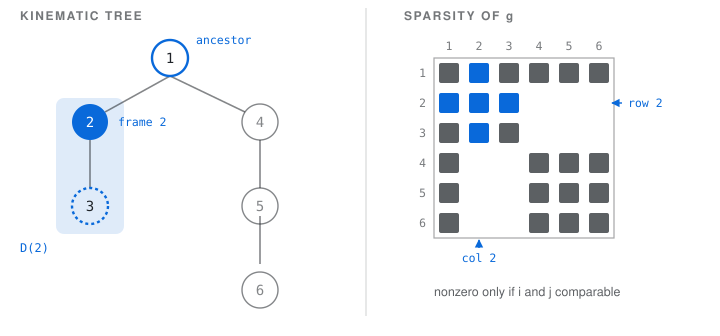
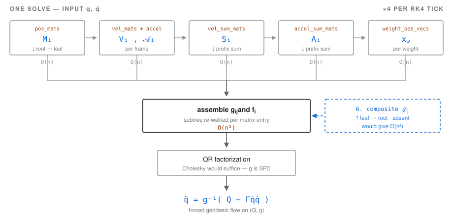

# The physm equations of motion

The physm solver is a **product-of-exponentials kinematic tree in SE(2)**, whose mass
matrix is a **mass-weighted pullback metric** and whose right-hand side is a **Christoffel
symbol of the first kind**. This document recovers that structure from the implementation,
maps each invented identifier onto the standard object it computes, and records where the
memoization stops short.

Recovered by reading [`physm-rs/src/solver.rs`](../physm-rs/src/solver.rs) and its
supporting modules in full, with [`physm-py/notes.txt`](../physm-py/notes.txt)
(Nov–Dec 2019) for the provenance of the naming. The `physm-py` and `physm-js`
implementations compute the same thing.

## Contents

1. [Two vocabularies](#1-two-vocabularies)
2. [The kinematic model](#2-the-kinematic-model)
3. [The identity everything rests on](#3-the-identity-everything-rests-on)
4. [The sweeps](#4-the-sweeps)
5. [Assembly](#5-assembly)
6. [Integration](#6-integration)
7. [Where the implementation stops short](#7-where-the-implementation-stops-short)

### Notation

$n$ frames indexed $i, j, k$; $p(i)$ the parent; $`i \preceq j`$ means *"$`i`$ is an
inclusive ancestor of $`j`$"* (the `^^` of the 2019 notes); $D(i)$ the subtree rooted at $i$;
$w$ ranges over point masses and $f(w)$ is the frame carrying $w$.

---

## 1. Two vocabularies

The source names came before the terminology. Nothing needs renaming to be rigorous — the
objects were already right.

| Name in `solver.rs` | Standard object | Symbol |
| --- | --- | --- |
| `frame` | One-DOF joint plus its child link; node of the kinematic tree | $i$ |
| `q`, `qd` | Generalized coordinate and velocity — a point of $TQ$ | $`q^i`$, $`\dot q^i`$ |
| `get_local_pos_matrix` | Joint transform, $`L_i(q) = C_i \exp(q\hat\zeta_i) \in SE(2)`$ | $`L_i`$ |
| `pos_mats[i]` | Spatial pose; the product of exponentials along the root path | $`M_i`$ |
| `inv_pos_mats[i]` | Inverse pose, taken by general 3×3 inversion of an $`SE(2)`$ element | $`M_i^{-1}`$ |
| `get_local_vel_matrix` | Joint-transform derivative, $`\partial_q L_i = L_i\hat\zeta_i`$ | — |
| `get_local_accel_matrix` | Second derivative, $`\partial_q^2 L_i = L_i\hat\zeta_i^2`$ | — |
| **`vel_mats[i]`** | **Spatial Jacobian column** — the joint screw pushed into the world frame, $`\mathrm{Ad}_{M_i}\hat\zeta_i \in \mathfrak{se}(2)`$ | $`V_i`$ |
| `accel_mats[i]` | Second-order screw term; equals $`V_i^2`$ exactly ([§4](#4-the-sweeps)) | $`\mathcal{A}_i`$ |
| **`vel_sum_mats[i]`** | **Spatial twist** of body $i$: $`\dot M_i M_i^{-1}`$ | $`S_i`$ |
| **`accel_sum_mats[i]`** | **Bias (velocity-product) spatial acceleration** — the $`\ddot q`$-free part of $`\ddot M_i M_i^{-1}`$ | $`A_i`$ |
| `weight_pos_vecs` | The image of the configuration→physical map $`\varphi`$, evaluated | $`x_w`$ |
| **`composite_moment_mats[i]`** | Composite second moment of $`D(i)`$, accumulated leaf-to-root | $`\mathcal{J}_i`$ |
| **`composite_force_mats[i]`** | Composite applied-force moment of $`D(i)`$, likewise | $`\mathcal{K}_i`$ |
| **`coefficient_matrix`** | **Pullback metric** $`g = \varphi^*(\bigoplus_w m_w\delta)`$ — the joint-space inertia, i.e. the mass matrix | $`g_{ij}`$ |
| **`force_vector`** | Generalized force minus the Christoffel term: $`Q_i - \Gamma_{i,jk}\dot q^j \dot q^k`$ | $`f_i`$ |
| `resistance`, `drag` | Rayleigh dissipation coefficients — joint-space and task-space | $`c_i`$, $`b_w`$ |

---

## 2. The kinematic model

`RotationalFrame` and `TrackFrame` look like different animals in the source — one builds a
matrix out of `q.cos()` and `q.sin()`, the other out of a fixed `angle` scaled by `q`. They
are the same object:

```math
L_i(q) \;=\; C_i\,\exp\!\big(q\,\hat\zeta_i\big), \qquad C_i \in SE(2),\quad \hat\zeta_i \in \mathfrak{se}(2)
```

with $`C_i = T(p_i)`$ the constant anchor offset in both cases, and the *constant body-frame
generator* $`\hat\zeta_i`$ being the rotation generator $`\hat J`$ for a revolute frame and
the nilpotent $`\hat n(\alpha)^\flat`$ for a prismatic one. So

```math
M_i \;=\; \prod_{k \preceq i} C_k \exp\!\big(q^k \hat\zeta_k\big)
```

is literally Brockett's **product of exponentials**. No basis was ever chosen; group
elements were composed.

That the prismatic generator is nilpotent, $`\hat\zeta^2 = 0`$, is exactly why `TrackFrame`
never overrides `get_local_accel_matrix` and inherits the `Mat3::zeros()` default — a fact
that reads as an omission in the source and is actually a theorem.

---

## 3. The identity everything rests on

```math
\frac{\partial M_j}{\partial q^i} \;=\; V_i\,M_j \quad (i \preceq j),
\qquad\qquad
V_i \;\equiv\; \frac{\partial M_i}{\partial q^i}M_i^{-1} \;=\; \mathrm{Ad}_{M_i}\hat\zeta_i
```

and $`\partial M_j / \partial q^i = 0`$ whenever $`i \not\preceq j`$.

One 3×3 matrix per degree of freedom differentiates every descendant pose, at any depth, by
left multiplication. That is the whole memoization, stated once. It is also why
`get_vel_mats` multiplies the local derivative by the inverse of the frame's *own global
pose* and then left-multiplies by the parent's pose — an operation that looks unmotivated
in the code and is just $`M_i \hat\zeta_i M_i^{-1}`$, the adjoint action carrying the body
screw into world coordinates.

### Two corollaries do the remaining work

**Second derivatives inherit an ordering.** $`V_i`$ depends only on $`q^k`$ for
$`k \preceq i`$, so for $`i \prec j`$ we get $`\partial_i\partial_j M = V_i V_j M`$ —
*ancestor first*. That asymmetry is real, and it is why `get_accel_sum_mats` carries the
one-sided `2. * qd * vel_sum_mats[parent_index] * vel_mats[index]` rather than an
anticommutator. For $i = j$, $`\partial_i^2 M = \mathcal{A}_i M`$.

**Sparsity is the tree order.** $`\partial_i x_w = 0`$ unless $`i \preceq f(w)`$, which is
precisely the `path_contains` test. The consequence is the classical branch-induced
sparsity of the joint-space inertia matrix: $`g_{ij} = 0`$ **unless $i$ and $j$ are
comparable in the tree order.** The converse fails — a comparable pair whose subtree carries
no weights is zero too, and so is any pair whose contributions happen to cancel at a given
configuration. What the tree gives is a *structural* confinement of the nonzeros, which is
what a sparse factorization would exploit; it is not an equivalence.

<picture>
  <source media="(prefers-color-scheme: dark)" srcset="figures/tree-sparsity-dark.svg">
  
</picture>

**The same fact, twice.** Left: frame 2's inclusive ancestor (ring) and subtree (shaded) —
the only frames whose motion it shares. Right: $g$ is structurally nonzero only on
comparable pairs,
so frame 2's row and column carry entries only at 1, 2, 3. Frames 2 and 4 lie on disjoint
branches, and the corresponding blocks are structurally zero — the code never even visits
them, via the `path_contains` guard in `get_coefficient_matrix_entry`.

---

## 4. The sweeps

Seven numbered sweeps, plus the two derived passes 1′ and 2′ that feed them. Sweeps 1–5 run
root-to-leaf in topological order; 6 and 7 run leaf-to-root, over the same array reversed. `sort_frames` is a reverse post-order, so every parent index
precedes its children — which is also what lets `get_descendent_frames` scan only forward
from its argument.

| # | Function | Object | Recurrence |
| --- | --- | --- | --- |
| 1 | `get_pos_mats` | $`M_i`$ | $`M_i = M_{p(i)}\,L_i(q^i)`$ |
| 1′ | `get_inv_pos_mats` | $`M_i^{-1}`$ | $`M_i^{-1}`$, by general inversion |
| 2 | `get_vel_mats` | $`V_i`$ | $`V_i = M_{p(i)}\,(\partial_q L_i)\,M_i^{-1}`$ |
| 2′ | `get_accel_mats` | $`\mathcal{A}_i`$ | $`\mathcal{A}_i = M_{p(i)}\,(\partial_q^2 L_i)\,M_i^{-1}`$ |
| 3 | `get_vel_sum_mats` | $`S_i`$ | $`S_i = S_{p(i)} + \dot q^i V_i`$ |
| 4 | `get_accel_sum_mats` | $`A_i`$ | $`A_i = A_{p(i)} + (\dot q^i)^2\mathcal{A}_i + 2\dot q^i S_{p(i)}V_i`$ |
| 5 | `get_weight_pos_vecs` | $`x_w`$ | $`x_w = M_{f(w)}\,r_w`$ |
| 6 | `get_composite_moment_mats` | $`\mathcal{J}_i`$ | $`\mathcal{J}_i = \sum_{w\,\text{on}\,i} m_w x_w x_w^{\mathsf T} + \sum_c \mathcal{J}_c`$ &nbsp;(*leaf-to-root*) |
| 7 | `get_composite_force_mats` | $`\mathcal{K}_i`$ | $`\mathcal{K}_i = \sum_{w\,\text{on}\,i} u_w x_w^{\mathsf T} + \sum_c \mathcal{K}_c`$ &nbsp;(*leaf-to-root*) |

Sweeps 3 and 4 are prefix sums along the root path, and what they accumulate is the
kinematics of any attached point:

```math
\dot x_w \;=\; S_{f(w)}\,x_w,
\qquad\qquad
\ddot x_w \;=\; \Big(\sum_{i \preceq f(w)} \ddot q^{\,i} V_i\Big) x_w \;+\; A_{f(w)}\,x_w
```

The 2019 notes record the reaction to this: *"if these equations are true then this is a
bit miraculous: the velocity of any point can be expressed as a matrix times a local
position — seems too good to be true."* It is true, it is the standard spatial-velocity
representation, and the miracle is only that $`\mathrm{Ad}`$ is a homomorphism.

> [!NOTE]
> **Derived here — not in the source.** Sweep 2′ is redundant: since
> $`\partial_q^2 L_i = L_i\hat\zeta_i^2`$, we get $`\mathcal{A}_i = M_i\hat\zeta_i^2 M_i^{-1} = (M_i\hat\zeta_i M_i^{-1})^2 = V_i^2`$.
> So `get_accel_mats` and the whole `get_local_accel_matrix` trait method carry no
> information beyond sweep 2. Kept general, presumably, against a frame type that is not a
> one-parameter subgroup — neither of the two is such a type.

**Derived here — not in the source: the bias term is a sum of Lie brackets.** Expanding the
sweep-4 recurrence and comparing against $`S_i^2`$:

```math
A_i \;=\; S_i^{\,2} \;+\; \sum_{k \,\prec\, l \,\preceq\, i} \dot q^k \dot q^l\,\big[\,V_k,\,V_l\,\big]
```

Coriolis *is* the non-commutativity of the joint screws. The correction to a naive "square
the twist" is exactly the failure of $`\mathfrak{se}(2)`$ to be abelian.

<picture>
  <source media="(prefers-color-scheme: dark)" srcset="figures/dataflow-dark.svg">
  
</picture>

**Where the cost actually is.** Five linear-time sweeps feed a shared bus; the assembly that
consumes them contracts one pair of screws per ancestor relation, which is
$`O(n \cdot \mathrm{depth})`$ — see
[§5](#the-assembly-factors-the-leaf-to-root-sweeps). Sweeps 6 and 7 run the other way, leaf
to root, over the same sorted array reversed. Everything above the bus runs four times per
tick under RK4, correctly, since it depends on state; the tree ordering it uses is rebuilt
with it and need not be.

---

## 5. Assembly

### The coefficient matrix is the pullback metric

```math
g_{ij} \;=\; \sum_{w \,:\, j \preceq f(w)} m_w \,\big\langle V_i x_w,\; V_j x_w\big\rangle
\;=\; \sum_w m_w\,\delta_{ab}\,\partial_i x_w^{\,a}\,\partial_j x_w^{\,b}
\qquad (i \preceq j)
```

With physical space $`\mathbb{R}^2`$ carrying the Euclidean metric $`\delta`$ and each
weight contributing $`m_w\delta`$, this is $`g = \varphi^*\big(\bigoplus_w m_w\delta\big)`$ —
the mass-weighted pullback along $`\varphi : Q \to (\mathbb{R}^2)^W`$. Kinetic energy is
$`T = \tfrac12 g_{ij}\dot q^i\dot q^j`$; the code builds $g$ itself, correctly without the
$`\tfrac12`$, and fills the lower triangle by symmetry. The summation range in
`get_coefficient_matrix_entry` is right because
$`\mathrm{supp}(\partial_i)\cap\mathrm{supp}(\partial_j) = D(j)`$ when
$`i \preceq j`$.

### The force vector is force minus Christoffel

```math
\begin{aligned}
f_i \;=\;\; & \underbrace{\sum_{w \in D(i)} m_w\langle V_i x_w, \mathbf{g}\rangle}_{-\,\partial_i U}
  \;\underbrace{-\sum_{w \in D(i)} b_w \langle V_i x_w, S_{f(w)}x_w\rangle \;-\; c_i\dot q^i}_{-\,\partial\mathcal{F}/\partial\dot q^i \;\text{(Rayleigh)}} \\[1.4ex]
  & +\; \underbrace{Q_i^{\text{ext}}}_{\text{external}}
  \;\underbrace{-\sum_{w \in D(i)} m_w\langle V_i x_w, A_{f(w)}x_w\rangle}_{-\,\Gamma_{i,jk}\dot q^j\dot q^k}
\end{aligned}
```

That last group is the local `kinetic_force_vec`, and it is the **Christoffel symbol of the
first kind**, via the identity that holds for any metric induced by an embedding:

```math
\Gamma_{i,jk} \;=\; \tfrac12\big(\partial_j g_{ik} + \partial_k g_{ij} - \partial_i g_{jk}\big)
\;=\; \sum_w m_w \big\langle \partial_i x_w,\; \partial_j\partial_k x_w \big\rangle
```

Which makes `get_system_of_equations` a verbatim statement of the Euler–Lagrange equation in
covariant form, and `solve` a step of forced geodesic flow on $(Q, g)$:

```math
\boxed{\;g_{ij}\,\ddot q^{\,j} \;+\; \Gamma_{i,jk}\,\dot q^{\,j}\dot q^{\,k} \;=\; Q_i\;}
```

The "gnarly simplification" remembered from the original derivation is that Christoffel
identity. It was found by hand, in matrix form, without the name attached.

### The assembly factors: the leaf-to-root sweeps

Both assembled objects are sums over a subtree of terms that are *bilinear* in $`V`$ and the
weight positions, so the subtree sum can be lifted out of the per-entry loop entirely.
Writing $`\langle A, B\rangle_F = \mathrm{tr}(A^{\mathsf T} B)`$ for the Frobenius product:

```math
g_{ij} \;=\; \mathrm{tr}\!\big(V_i^{\mathsf T} V_j\, \mathcal{J}_j\big),
\qquad
\mathcal{J}_j \;\equiv\; \sum_{w \in D(j)} m_w\, x_w x_w^{\mathsf T}
```

```math
f_i \;=\; \big\langle V_i,\, \mathcal{K}_i \big\rangle_F \;-\; c_i\dot q^i \;+\; Q_i^{\text{ext}},
\qquad
\mathcal{K}_i \;\equiv\; \sum_{w \in D(i)} u_w\, x_w^{\mathsf T},
\qquad
u_w \;\equiv\; m_w\mathbf{g} - m_w A_{f(w)}x_w - b_w S_{f(w)}x_w
```

$`\mathcal{J}`$ and $`\mathcal{K}`$ are single 3×3 matrices per frame, and both accumulate
by the same **leaf-to-root** recurrence — the mirror image of sweeps 1, 3 and 4:

```math
\mathcal{J}_i \;=\; \sum_{w \,\text{on}\, i} m_w x_w x_w^{\mathsf T} \;+\; \sum_{c \,\in\, \text{children}(i)} \mathcal{J}_c
```

Since `sort_frames` already orders parents before children, one reverse pass over that same
array computes them. The joint-local terms $`-c_i\dot q^i`$ and $`Q_i^{\text{ext}}`$ need no
accumulation — they belong to $i$ alone.

This is the **Composite Rigid Body Algorithm**, and the $`\mathcal{K}`$ half is the backward
pass of **RNEA**. It reduces the mass matrix to $`O(n \cdot \mathrm{depth})`$ and the force
vector to $O(n)$.

`get_coefficient_matrix` walks `index_path_map[j]` — which *is* the list of $j$'s inclusive
ancestors — rather than testing all $n^2$ pairs, so the comparability test disappears instead
of being made cheaper, and both triangles are written as they are computed. There is no
`fill_lower_triangle_with_upper_triangle` pass any more, and symmetry holds by construction.

---

## 6. Integration

`tick_runge_kutta_mut` is textbook **RK4** on $`y = (q, \dot q)`$ with
$`\dot y = (\dot q,\; a(q,\dot q))`$. All four stage combinations check out against the
standard tableau: $`k_1`$ at $`y_0`$, $`k_2`$ at $`y_0 + \tfrac{h}{2}k_1`$, $`k_3`$ at
$`y_0 + \tfrac{h}{2}k_2`$, $`k_4`$ at $`y_0 + hk_3`$, combined
$`\tfrac16(k_1 + 2k_2 + 2k_3 + k_4)`$. It is the default (`runge_kutta: true` in
`Solver::new`), and it calls `solve` — hence all five sweeps — four times per tick.

`tick_simple_mut` is **forward Euler**, not semi-implicit: `q` is advanced using the
pre-step `qd`, so both updates read pre-step state. For an oscillatory mechanical system
that is the one first-order scheme with the wrong energy behaviour — it gains energy every
step. Swapping the two lines would make it semi-implicit Euler and approximately symplectic,
at zero cost.

---

## 7. Where the implementation stops short

Everything above describes the algorithm and stays true regardless of how it is
coded. This section is the volatile one: it describes the Rust implementation as it
stands at this commit, and is expected to go out of date as the code changes.

### It is a forest, not a DAG — *structural*

`children: Vec<Box<dyn Frame>>` is unique ownership, so no node can have two parents. The
`index_path_map` and `path_contains` machinery *looks* DAG-ready, but `get_index_path_map`
memoizes exactly one path per node, and its `contains_key` guard short-circuits before the
recursion — so a genuine second parent would silently drop that subtree's paths rather than
pick a wrong one.

Duplicate frame ids do collide in `get_id_index_map`, and the resulting failure surfaces
late and nowhere near its cause: `debug_assert_eq!(index_path_map.len(), frames.len())` in
`get_pos_mats` under a debug build, or a `HashMap` index panic on a missing child in
release. Neither mentions ids.

**There are two routes to the DAG, and they are not equally costly.** Generalising the
*frames* means $`\partial_i M_j = V_i M_j`$ becomes a sum over the paths from $i$ to $j$, and
the comparability test that gives $g$ its sparsity becomes reachability. It also means a node
with two parents has no single product of exponentials, so there is no $`M_j`$ for
$`\mathrm{Ad}`$ to act on — §§2–5 do not survive that.

The other route keeps the tree a tree and admits the extra relations as **Lagrange-multiplier
rows on an augmented system**. `physm-py` in this repo already does it: `NaiveSolver._solve`
sizes its matrix `nframes + nconstraints`, assembles the frame block by the same
comparability walk the Rust uses, appends the constraint rows, and discards the multipliers
on the way out — with `Spring` and `Constraint` as first-class scene nodes. That is what the
2019 notes' springs and constraints were heading toward, and it leaves everything above
intact.

### The assembly used to be quadratic in the wrong thing — *resolved*

Until the composite sweeps landed, `get_coefficient_matrix_entry` re-summed the weights of
$`D(j)`$ for *every* comparable pair, and `get_descendent_frames` was itself
$`O(n \cdot \mathrm{depth})`$ — it scanned the whole suffix of the sort order and decided
membership by walking each candidate's entire root path. Two terms came out of that on a
chain: $`\Theta(n^4)`$ root-path comparisons, and $`\Theta(n^3)`$ floating-point work.

Both are gone, and the measured effect is worth recording because the two terms make the
asymptotics misleading over any practical range. `bench_assembly` in `solver.rs`, chain
scenes, release build:

| $n$ | naive (µs) | composite (µs) | speedup |
| ---: | ---: | ---: | ---: |
| 10 | 12.1 | 3.0 | 4.0× |
| 20 | 82.2 | 8.5 | 9.7× |
| 40 | 524.3 | 24.4 | 21.5× |
| 80 | 3 969.4 | 86.7 | 45.8× |
| 160 | 35 139.6 | 285.2 | 123.2× |
| 320 | 400 384.9 | 1 100.3 | 363.9× |

The naive column's ratio per doubling climbs 6.4 → 7.6 → 8.9 → 11.4 rather than sitting at
16: the cheap $`\Theta(n^4)`$ comparisons only overtake the expensive $`\Theta(n^3)`$
floating-point work somewhere inside this range. Quoting $`\Theta(n^4)`$ without that caveat
would predict the wrong number at every $n$ measured here. The composite column grows about
3.9× per doubling, which is the $`O(n \cdot \mathrm{depth})`$ bound with $`\mathrm{depth} = n`$
for a chain.

**One saving remains unclaimed, and it is independent of this one.** The old cost had two
causes — the per-entry subtree walk, now gone, and `get_descendent_frames` being linear in
depth rather than $O(1)$. Nothing in the current code calls it, so the second never had to be
fixed; if a future change needs descendant sets again, memoizing them once per solve is the
separate fix, and should not be measured against the pre-composite baseline.

### Static structure is rebuilt every tick — *complexity*

`sort_frames` and `get_index_path_map` run once per `tick_mut`, which hands their results to
the integrator by reference; they are pure functions of the topology and belong on `Solver`.
`get_weight_offsets` is the odd one out — it sits inside `get_system_of_equations`, so it
runs once per RK4 *stage*, four times per tick, and has to come out of there before there is
anywhere to hoist it to.

`get_inv_pos_mats` is a full pass per solve as well, and takes a general 3×3 inverse of a
matrix that is always in $`SE(2)`$, where the inverse is
$`[\,R^{\mathsf T} \mid -R^{\mathsf T}t\,]`$ and costs a handful of flops. Cheaper to fix
than either of the above.

### A singular matrix, with an unwrap behind it — *robustness*

$g$ is the Gram matrix of the columns of the mass-weighted stacked Jacobian, so it is
positive **semi**definite always, and positive definite exactly when those columns are
linearly independent. Every degree of freedom moving *some* mass makes the diagonal entries
positive; it does not make the columns independent.

It goes singular two ways, and they want different handling. $`\mathrm{rank}\,g \le 2W`$ for
$W$ weights, so any scene with fewer than $n/2$ weights is singular at *every* configuration;
a subtree with no weights at all gives an exactly-zero row, which is structural and cheap to
check once, up front. The other is a rank drop at isolated configurations — a two-link chain
with a single tip mass has $`\det g \propto \sin^2 q_b`$, so it degenerates every time the
links align, with severe ill-conditioning either side of it and nothing to assert on. A
pendulum passes through that on every swing.

Cholesky is generically about half the work of the QR in use, but neither factorization makes
`coefficient_matrix.qr().solve(&force_vector).unwrap()` a reasonable thing to leave there.

*(The other `unwrap` in the file, in `get_inv_pos_mats`, genuinely cannot fire: every
`pos_mat` is a product of $`SE(2)`$ elements and so has determinant 1.)*

---

## Colophon

Results marked **Derived here** are not in the source and were checked against the code's own
recurrences; everything else is a restatement of what `solver.rs` computes.

Figures are committed as light/dark pairs under [`figures/`](figures/) and selected by
`<picture>`; see [`figures/README.md`](figures/README.md) for the colour tokens that
distinguish the two variants.
